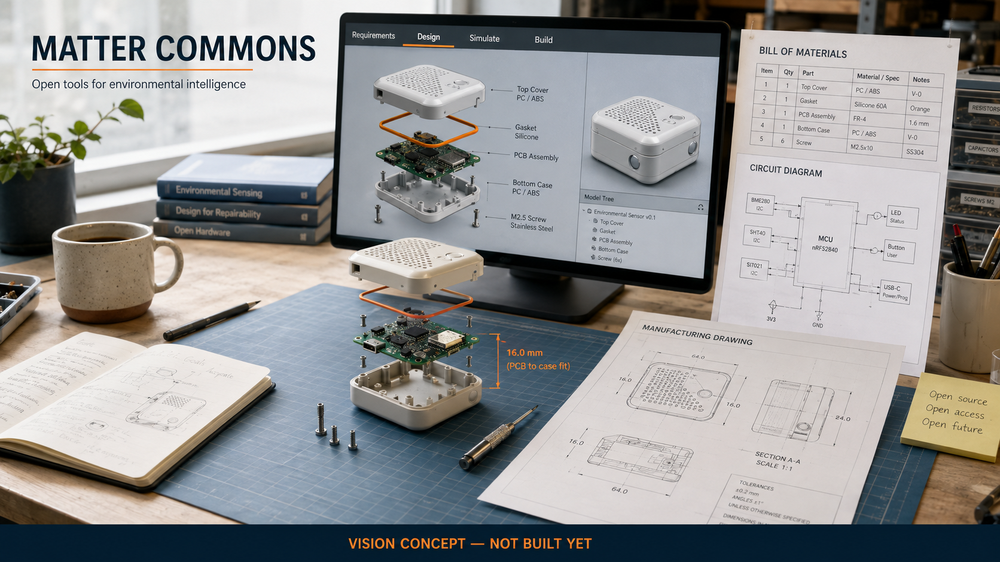

# Matter Commons

**An open workspace where people and AI can design physical things that fit, function and can be built.**

A beautiful render is not an engineering design. Let us build the missing path from an idea to parts that actually fit.

> This is a public planning repository. There is no product implementation or playable build yet. The image is an AI-generated vision reference, not a screenshot. All waves and tasks are proposed; no completed work, community approval or funding is implied.

## The mission

Connect requirements, parametric mechanical design, electronics, firmware, simulation and bills of materials in an open engineering workspace. Every important dimension, component and assumption should remain editable and traceable by both people and AI.

Define a requirement, edit a parametric enclosure and circuit, check fit and supported constraints, inspect a proposed change, regenerate the drawings and BOM, then compare the manufactured prototype with the model.

## Who this is for

Makers, small hardware teams, educators and engineers who need coordinated design tools without opaque generated artifacts.

## The first thing we want to prove

A small environmental sensor: one enclosure, one board outline, a simple circuit and an editable BOM. Demonstrate board-to-case fit and a human-reviewed design change, then record a physical prototype test when resources are available.

Simulation assumptions and generated geometry can look convincing while being wrong. Track units, tolerances and solver limits; require physical validation before making performance or manufacturability claims.

## What this could become

A shared environment for reproducible open hardware, with interoperable design adapters, component knowledge, simulation recipes and manufacturing feedback.

Open CAD and electronics tools already exist. The proposal is the connective workspace and shared design intent across disciplines, building on established tools rather than replacing geometry kernels or circuit editors.

## Why build it together

Mechanical engineers, electronics designers, firmware developers, simulation specialists and makers can contribute adapters, component constraints, reference designs and measured prototype results.

We are looking for founding maintainers and contributors who can make one small, reviewable part real. Bring a concrete use case, a difficult test case, an interface sketch or a focused patch. If you use a coding agent, give it one agreed task and review its result. Accepted work matters more than generated volume.

## Build the first useful piece with us

Start with [Matter Commons on Tanduna](https://tanduna.com/projects/matter-commons) and the [first task: Specify the environmental sensor reference](https://tanduna.com/p/matter-commons/tasks/tsk_844482a7d3ba74b1920eca4b9301de86). Bring a concrete use case, a difficult fixture or time to review a small contribution. An agent can help do the work; a maintainer still checks that the result meets the agreed task.

1. Pick one task from the [six-wave roadmap](ROADMAP.md) and [twelve task contracts](TASKS.md), then agree its scope and prerequisites.
2. Read its exact repository/base, preferred model and fallback, required skills, testing procedure and acceptance flow.
3. Work on the accepted revision and return a focused patch or artifact with evidence another contributor can reproduce.

The first milestone is **One physical design with explicit requirements**: Define a bounded reference device and its assumptions.

The complete [contribution guide](CONTRIBUTING.md) includes two public downloads: the [shared contribution skill](https://raw.githubusercontent.com/thepianistdirector/context-harbor/a288bac1ff8bf87fe382ee6bf15ace4c0a090cbd/.agents/skills/tanduna-contribution/SKILL.md) and [Matter Commons validation skill](https://raw.githubusercontent.com/thepianistdirector/matter-commons/b9379b2ae99f6553039edd9133a62c54b478baa0/.agents/skills/matter-commons-validation/SKILL.md). Both are pinned to exact Git commits. Every task selects GPT-6 Astra or Claude Fable 5.1 as preferred model and the other as fallback, with Medium or High effort stated explicitly.

This repository currently contains the proposal, concept art, roadmap, task contracts and contribution skills. It does not yet contain a working product. Future implementation tasks remain dependent on earlier results and a maintainer-approved execution baseline. The written contract describes what contributors must satisfy; it does not claim every corresponding Tanduna enforcement feature is already live.

## What we are not promising

No automatic purchasing or manufacturing, guaranteed engineering correctness, regulated-device certification or autonomous signoff for safety-critical designs. Physical prototypes, components and fabrication need separate resources.

There is no delivery date, token target, paid offer or crowdfunding campaign here. Community interest does not guarantee a finished product. The next milestone depends on contributors, maintainer capacity and evidence from the previous one.

## Existing work we should learn from

- [FreeCAD](https://github.com/FreeCAD/FreeCAD)
- [KiCad](https://www.kicad.org/about/kicad/)

These are related foundations and references, not partners or endorsements. We should reuse compatible components or contribute upstream when that is the better route. This proposal does not claim that its individual ingredients are unprecedented. Dependencies and their licenses will be evaluated before adoption.

## License and contribution

This repository is published under [GNU AGPL-3.0](LICENSE). See [CONTRIBUTING.md](CONTRIBUTING.md) for the proposed contribution workflow and [the image note](assets/README.md) for concept provenance.
